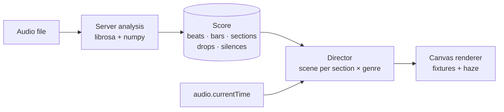

<div align="center">


# Rainy

**A self-hosted music server with a concert-grade light show.**<br>
Your library, your playlists, your friends, every device — no subscription, no cloud.

<p>
  
  
  
  
  
  
</p>

[Quick start](#-quick-start) · [Features](#-features) · [Light show](#-the-light-show) · [Configuration](#-configuration) · [GPU](docs/GPU.md) · [Development](#-development)

</div>

---

## Why Rainy

Rainy scans the music you already own, lets you add more from YouTube and Spotify playlists, and turns it all into a fast, installable web player that follows you across devices. Everything runs on your own hardware: audio analysis, genre classification, lyrics alignment and recommendations are computed locally, with no API keys required.

| | |
| --- | --- |
| **Yours** | Self-hosted, multi-user, with per-account libraries and roles. |
| **Smart** | Local audio analysis powers mixes, discovery, radio and BPM-aware shuffle. |
| **Alive** | A server-analysed, beat-locked light show for the fullscreen player. |
| **Everywhere** | Installable PWA, media-key support, Chromecast and cross-device remote control. |
| **Light on dependencies** | Vanilla ES modules on the front end; Flask and MySQL on the back end. |

## ✨ Features

### Playback
- **Crossfade**, **10-band equalizer**, **playback speed** (0.25× steps), **A–B repeat** and **sleep timer**
- Shuffle bag (no repeats until the cycle is exhausted) and **BPM-aware shuffle**
- **Fullscreen player** with synced lyrics, word-level highlighting and the light show
- Media Session integration: lock-screen controls, artwork and hardware media keys
- Full **keyboard shortcuts** with an in-app cheat sheet (press `?`)
- Installable **PWA** with an offline-capable shell

### Library
- Scans MP3, FLAC, WAV, OGG, M4A, AAC and WMA with tag, cover and duration extraction
- **Metadata search and apply**, artist pages with scraped bios, albums and artist views
- **Duplicate detection**: SHA-256 for exact copies, [Chromaprint](https://acoustid.org/chromaprint) acoustic fingerprints for the same song from different sources
- Uploads, downloads and per-song audio-feature enrichment (Last.fm tags and MusicBrainz IDs are optional)
- **Local genre classification** with the Discogs-EffNet model (400 styles, runs offline on ONNX)

### Discovery
- **Personalised mixes**: Supermix, My Mix 1…N, Discover, Replay, Rediscover, *“Because you listen to…”* artist mixes and mood mixes (Energize, Chill, Focus, Workout, Party, Sleep)
- Every mix is sequenced by a nearest-neighbour walk over audio features, so neighbouring tracks flow
- **Radio** (“songs that sound like this”) and **Discover** inside global search
- Listening history with top tracks, artists and genres

### Import and sync
- **YouTube** and **YouTube Music** search, preview and import, including whole playlists
- **Spotify** public playlist import, with no credentials needed
- **Playlist syncs** that keep a local playlist in step with a remote one (every 24 h by default, configurable per sync)
- A background job queue with live progress, per-user scoping and cancellation
- **yt-dlp manager** that auto-updates and solves YouTube's JS challenges so downloads keep working

### Social and multi-device
- **Friends**, playlist sharing with **admin / viewer** collaborator roles, and invites
- **Rainy Connect**: discover your other devices and control playback remotely
- **Chromecast** support, with LAN-IP discovery for casting from a self-hosted server
- Roles (`user` / `sysadmin`), per-account library isolation and an optional full-library permission
- Playlist export and auto-generated mosaic covers

## 🎆 The light show

Rainy turns the fullscreen player into a choreographed stage: lasers, moving-head beams, washes, LED pixel bars, haze, sparks and shockwaves, all locked to the music.



- **Analysed ahead of time.** After import, the server computes beats, downbeats, kick / snare / hat hits, section labels (intro, verse, chorus, build, drop, breakdown, outro), riser / drop / impact / silence events, key and genre profile. The renderer knows what is coming *before* it happens.
- **Deterministic.** Scenes are pure functions of the musical position, so seeking lands on exactly the picture uninterrupted playback would show.
- **Genre-aware.** A director picks scenes by section and profile (EDM, pop, rock, hip-hop, Latin, chill, orchestral), rotates variations every 8 bars and derives palettes from the song's key.
- **Safe by default.** Strobes are photosensitivity-limited, and a live fallback source drives the show while a song's analysis is still pending.
- **Fast.** Analysis uses every CPU core and can use an NVIDIA GPU for an extra speed-up, with results identical on every path.

| Analysis of a 216 s track | Time |
| --- | --- |
| Single-threaded (previous) | 8.3 s |
| Multi-threaded CPU (Ryzen 5 5600X) | 2.8 s |
| CUDA GPU (RTX 4060 Ti) | 1.9 s |

GPU support is optional and checked at startup, including a dedicated check for **Tesla V100 (Volta, `sm_70`)**. If a GPU can't be used, Rainy logs why and falls back to CPU. See **[docs/GPU.md](docs/GPU.md)**.

## 🚀 Quick start

### Docker (recommended)

```sh
cp .env.example .env      # then fill in the secrets (see below)
docker compose up --build -d
```

Open <http://localhost:6969>, complete the initial setup and enter `/music` as the library path. That is the path *inside* the container and it maps to `MUSIC_LIBRARY_PATH` on the host.

Set these in `.env` before the first start:

| Variable | What to put |
| --- | --- |
| `FLASK_SECRET_KEY` | 32+ random characters: `python -c "import secrets; print(secrets.token_hex(32))"` |
| `MYSQL_PASSWORD`, `MYSQL_ROOT_PASSWORD` | Strong, unique passwords |
| `MUSIC_LIBRARY_PATH` | Absolute path to your music, or keep `./music` to start with an empty library |

The stack is two services: `app` (Gunicorn, 2 workers × 4 threads) and `db` (MySQL 8.4). Data persists in the `mysql_data` volume, and your music directory is a host mount, so rebuilds lose nothing.

> **No NVIDIA GPU?** `compose.yaml` reserves all NVIDIA GPUs for `app` (`deploy.resources.reservations.devices`). On a host without the NVIDIA Container Toolkit, delete that `deploy:` block. Rainy runs on CPU either way.

```sh
docker compose logs -f          # follow logs
docker compose down             # stop
docker compose down -v          # stop and delete the database volume (music is kept)
```

### Run locally

Requirements: **Python 3.11+**, a **MySQL 8** server, **ffmpeg** and a JS runtime (Deno, Node or Bun) for yt-dlp.

```sh
python -m venv .venv
.venv/Scripts/activate           # Linux/macOS: source .venv/bin/activate
pip install -r requirements.txt
cp .env.example .env             # set FLASK_SECRET_KEY and the MYSQL_* values
python app.py
```

On Windows, `start.bat` does all of this: it creates the virtualenv, installs requirements, copies `.env` and starts the server. Set `RAINY_DEV=1` to allow an auto-generated session secret and the debug server for local development only.

## ⚙️ Configuration

All settings live in `.env` (see [.env.example](.env.example)).

| Variable | Default | Purpose |
| --- | --- | --- |
| `FLASK_SECRET_KEY` | *required* | Session signing key (32+ chars) |
| `MYSQL_HOST` / `MYSQL_PORT` / `MYSQL_USER` / `MYSQL_PASSWORD` / `MYSQL_DATABASE` | `localhost` / `3306` / `root` / – / `rainy` | Database connection (Compose wires this for you) |
| `RAINY_PORT` | `6969` | Host port published by Docker Compose |
| `RAINY_HTTP_PORT` | `6969` | Port for `python app.py` |
| `RAINY_DEV` | off | Dev mode: generated secret and Werkzeug debugger |
| `MUSIC_LIBRARY_PATH` | `./music` | Host path mounted at `/music` in Docker |
| `RAINY_LIGHTSHOW_DEVICE` | `auto` | `auto`, `cpu`, `cuda` or `cuda:N`, see [docs/GPU.md](docs/GPU.md) |
| `RAINY_LIGHTSHOW_THREADS` | cores, max 8 | CPU threads for light show analysis |
| `RAINY_WHISPER_MODEL` / `RAINY_LYRICS_LANG` | `base` / – | Model and language for word-level lyrics alignment |
| `RAINY_YTDLP_AUTO_UPDATE` | `1` | Update yt-dlp on container start (`0` pins the image version) |
| `LASTFM_API_KEY` | – | Optional Last.fm tags, similar artists and bios |
| `YT_OAUTH_CLIENT_ID` / `YT_OAUTH_CLIENT_SECRET` | – | Optional YouTube OAuth |
| `EXT_REPO_DIR` | – | Directory served as the external extensions repository |

**Optional extras**
- **GPU light show analysis:** install a CUDA build of `torch`. See [docs/GPU.md](docs/GPU.md).
- **Word-synced lyrics:** `faster-whisper` and `stable-ts` are in `requirements.txt`. Whisper on GPU also picks up `nvidia-cublas-cu12` and `nvidia-cudnn-cu12`.
- **HTTPS and Chromecast:** the Chromecast Web Sender needs a secure origin: use `localhost` or serve Rainy over HTTPS (for example behind a reverse proxy).

## 🧱 Architecture

```
Browser (vanilla ES modules, PWA, Web Audio)
   │   Component system · Context store · service layer
   ▼
Flask API (Gunicorn)  ──►  MySQL 8.4
   │
   ├── routes/    blueprints: music, playlists, friends, connect, smartmix, …
   ├── models/    data access and migrations
   └── utils/     background workers, one daemon thread each, started lazily
        ├── job_worker           imports (YouTube / Spotify / uploads)
        ├── enrichment_worker    audio features, genres, tags
        ├── lightshow_worker     light show scores (CPU / optional GPU)
        ├── lyrics_worker        lyrics lookup and word alignment
        ├── playlist_sync_worker scheduled remote playlist syncs
        └── ytdlp_manager        keeps yt-dlp working
```

The front end has no bundler or framework: UI is built from custom-element components with a tiny element-builder DSL (`H` / `h` / `s`, `a`, `on`, `p`) and a key-path context store. See [AGENTS.md](AGENTS.md) for the component conventions.

## 🧪 Development

```sh
pip install pytest soundfile
pytest                                   # backend tests
node --test tests/js                     # front-end tests
```

Some backend tests may need a reachable MySQL database, since the suite imports the full app. The light show analyser tests synthesise a known 72 s track and assert tempo, downbeats, drop and stop detection, so they need no fixtures.

```
app.py            application factory, worker startup
config.py         environment configuration
routes/           HTTP API (blueprints)
models/           database access
utils/            analysis, workers, importers, recommender
static/           PWA front end (js/, css/, sw.js, manifest.json)
scripts/          one-off maintenance: fingerprint backfill, genre classification
tests/            pytest and JS tests
docs/             extra documentation
```

## 🛟 Troubleshooting

| Symptom | Fix |
| --- | --- |
| Container exits with “Set FLASK_SECRET_KEY / MYSQL_PASSWORD…” | Fill in the required values in `.env` |
| `docker compose up` fails with “could not select device driver nvidia” | No NVIDIA toolkit on the host: remove the `deploy:` block in `compose.yaml` |
| YouTube downloads fail with 403 | Make sure a JS runtime is available; Rainy updates yt-dlp automatically. Use **Settings → Jobs → Update now** |
| Light show analysis stays on CPU | Check the `[lightshow-accel] analysis device:` log line. See [docs/GPU.md](docs/GPU.md) |
| Chromecast button missing | The page must be served over HTTPS or from `localhost` |

## 🙏 Built with

[Flask](https://flask.palletsprojects.com/) · [MySQL](https://www.mysql.com/) · [librosa](https://librosa.org/) · [PyTorch](https://pytorch.org/) (optional) · [faster-whisper](https://github.com/SYSTRAN/faster-whisper) · [stable-ts](https://github.com/jianfch/stable-ts) · [yt-dlp](https://github.com/yt-dlp/yt-dlp) · [ONNX Runtime](https://onnxruntime.ai/) with [Discogs-EffNet](https://essentia.upf.edu/models.html) · [Chromaprint](https://acoustid.org/chromaprint) · [MusicBrainz](https://musicbrainz.org/) · [Last.fm](https://www.last.fm/api)
